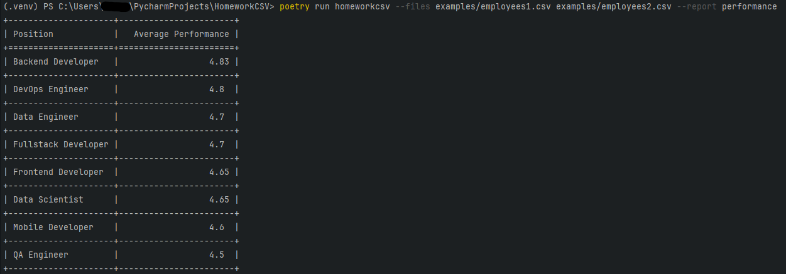
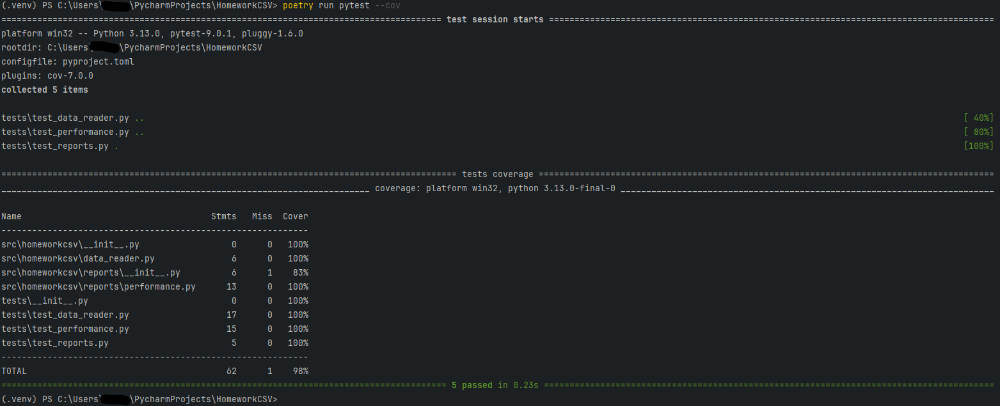

# HomeworkCSV

Проект для анализа CSV-файлов с данными о разработчиках.

poetry run homeworkcsv --files examples/employees1.csv examples/employees2.csv --report performance

poetry run pytest --cov
